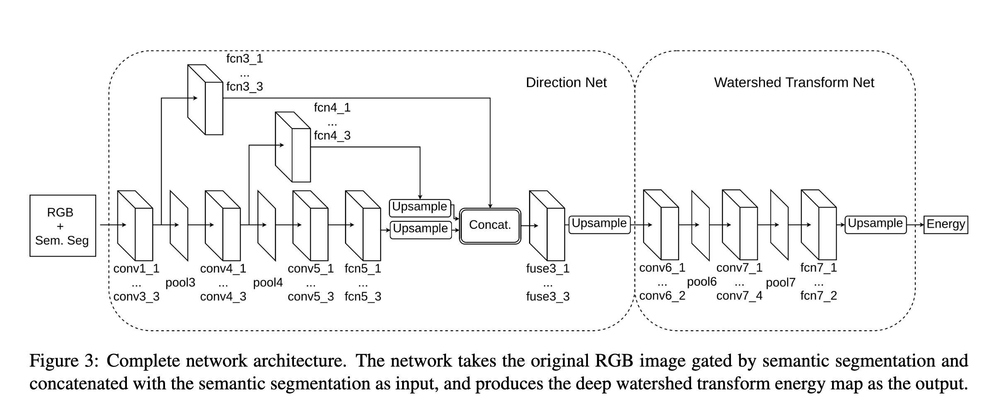

# A solution to the Sartorius Cell Instance Segmentation Kaggle
https://www.kaggle.com/c/sartorius-cell-instance-segmentation

# Challenge to-do list
- [ ] Use different image tranformations for validation.
- [ ] Monitor validation loss, instead of validation metric, for callbacks.
- [ ] Keep the channel dimension of mask through training like in segmentation_models_pytorch?
- [x] Get segmentation training going.
- [x] Generate normalised gradient of distance transform for training Direction Net.
- [x] Implement direction loss.
- [x] Construct Direction Net (DN).
- [x] Make datamodule for Direction Net training.
- [x] Get Direction Net training going.
- [x] Use the unique distance transform values of the image with largest range as the discrete watershed energy levels.  Try number of energy levels between 13 and 20.
- [x] Generate watershed energy maps. 
- [x] Build Watershed Transform Network (WTN)
- [x] Get WTN training going.
- [ ] Check if trained Unet does something.
- [ ] Pass sample inputs through Unet, DN and WTN and see if outputs are reasonable.
- [ ] Post-process sample watershed energy maps to get instances.
- [ ] Check DN architecture.
- [ ] Check direction loss definition.
- [ ] Check architecture of WTN.
- [ ] Check definition of watershed loss.

# Overall Architecture

# Notes on Deep Watershed Transform
*Watershed transform* is a method that comes from mathematical morphology.

# References
- [[ods.ai] topcoders, 1st place solution](https://www.kaggle.com/c/data-science-bowl-2018/discussion/54741)
- [@hengck23 [placeholder] my approach and results](https://www.kaggle.com/c/sartorius-cell-instance-segmentation/discussion/285516)
- [Deep Watershed Transform for Instance Segmentation](https://arxiv.org/pdf/1611.08303.pdf)
- https://github.com/min2209/dwt
- https://en.wikipedia.org/wiki/Distance_transform
- https://stackoverflow.com/questions/61716670/distance-transform-the-function-does-not-work-properly
- https://stackoverflow.com/questions/61204462/error-in-function-distancetransform-python-using-opencv-3-4-9

- https://github.com/MouseLand/cellpose
- https://github.com/YukangWang/TextField

# Questions
1. What are 1x1 convolutions for?