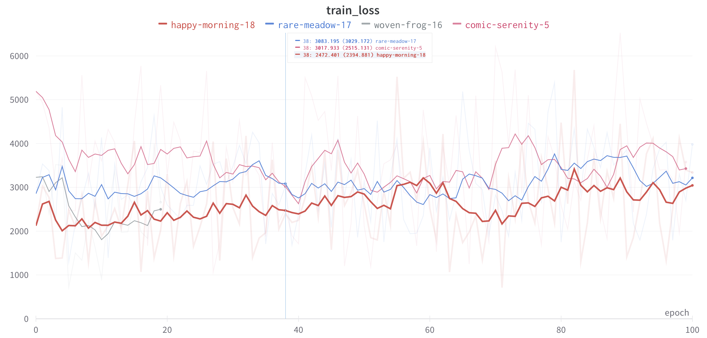

# A solution to the Sartorius Cell Instance Segmentation Kaggle
https://www.kaggle.com/c/sartorius-cell-instance-segmentation

# Challenge to-do list
- [ ] Use different image tranformations for validation.
- [ ] Monitor validation loss, instead of validation metric, for callbacks.
- [ ] Keep the channel dimension of mask through training like in segmentation_models_pytorch?
- [x] Get segmentation training going.
- [x] Generate normalised gradient of distance transform for training Direction Net.
- [x] Implement direction loss.
- [x] Construct Direction Net.
- [x] Make datamodule for Direction Net training.
- [x] Get Direction Net training going.

# Overall Architecture

# Direction Net

*2021-11-29*
The Direction Net appears to be training.  The above plot shows the various 'images' involved in the training of this network.  The network input is the original image that's been gated by the semantic segmentation, so it's an image where the background is removed.  The area of each cell, or instance, is used as weights calculating the loss.  

uvec_0 and uvec_1 are the 0th and 1st components of the noramlised gradient of distance transform.  It can be seen, from how the colour changes from red to blue, that uvec_0 changes along the y-direction, while uvec_1 changes along the x-direction.  It's important to understand that this should always be observed, regardless of the how the image is rotated.  A mistake I have made is to pre-compute these components based on the original image and simply treat them like other masks, like semantic segmentation and instance area.  This erroneous because whilst the semantic segmentation and instance area are invariant under image rotation, the components of the normalised gradient are not.  Therefore, they should be computed from the distance transform *after* any augmentation transforms.  This was confirmed in my experiments, where, when there is no data augmentation, the validation loss decreases even when the gradients are pre-computed, because there is no image rotation.  But when there is image rotation, the validation loss only decrease when the gradients are computed after the image rotation.

Another thing is the learning rate.  The authors used 1e-5 for 20 epochs.  I find that works; the validation loss decreases.  However, when I experimented with a one-cycle learning rate scheduler with a maximum learning rate of 1e-2, the validation loss does not really go down.  

cosmic-serenity-5 uses a constant learning rate of 1e-5 for 100 epochs.  

The following experiments include additional heavy data augmentations, and it's clear that the validation loss is lower for these.  rare-meadow-17 uses a maximum one-cycle learning rate of 1e-2, while happy-morning-18 uses 1e-3.  It's interesting that the validation loss decreases but suddenly start to increase, tending towards the same value as rare-meadow-17.  woven-frog-16 uses the same learning rate settings as the paper, a constant value of 1e-5 for 20 epochs.  

It appears that whether data augmentation is used or not, the validation loss tends to the same value.  It's just that in the case where data augmentation is used, it tends towards it from below, while without augmentation, it tends from above.  One apparent exception is woven-frog-16, and it would be interesting to see if it also tends to the same value when trained for more epochs.  

The training loss doesn't appear to decrease with epochs trained.

# Notes on Deep Watershed Transform
## Instance level segmentation approaches
### Proposal based
### Deep structure models
### Template matching
### Recurrent networks
### CNN
### Proposal + recursion

# References
- [[ods.ai] topcoders, 1st place solution](https://www.kaggle.com/c/data-science-bowl-2018/discussion/54741)
- [@hengck23 [placeholder] my approach and results](https://www.kaggle.com/c/sartorius-cell-instance-segmentation/discussion/285516)
- [Deep Watershed Transform for Instance Segmentation](https://arxiv.org/pdf/1611.08303.pdf)
- https://github.com/min2209/dwt
- https://en.wikipedia.org/wiki/Distance_transform
- https://stackoverflow.com/questions/61716670/distance-transform-the-function-does-not-work-properly
- https://stackoverflow.com/questions/61204462/error-in-function-distancetransform-python-using-opencv-3-4-9

- https://github.com/MouseLand/cellpose
- https://github.com/YukangWang/TextField

# Questions
1. What are 1x1 convolutions for?