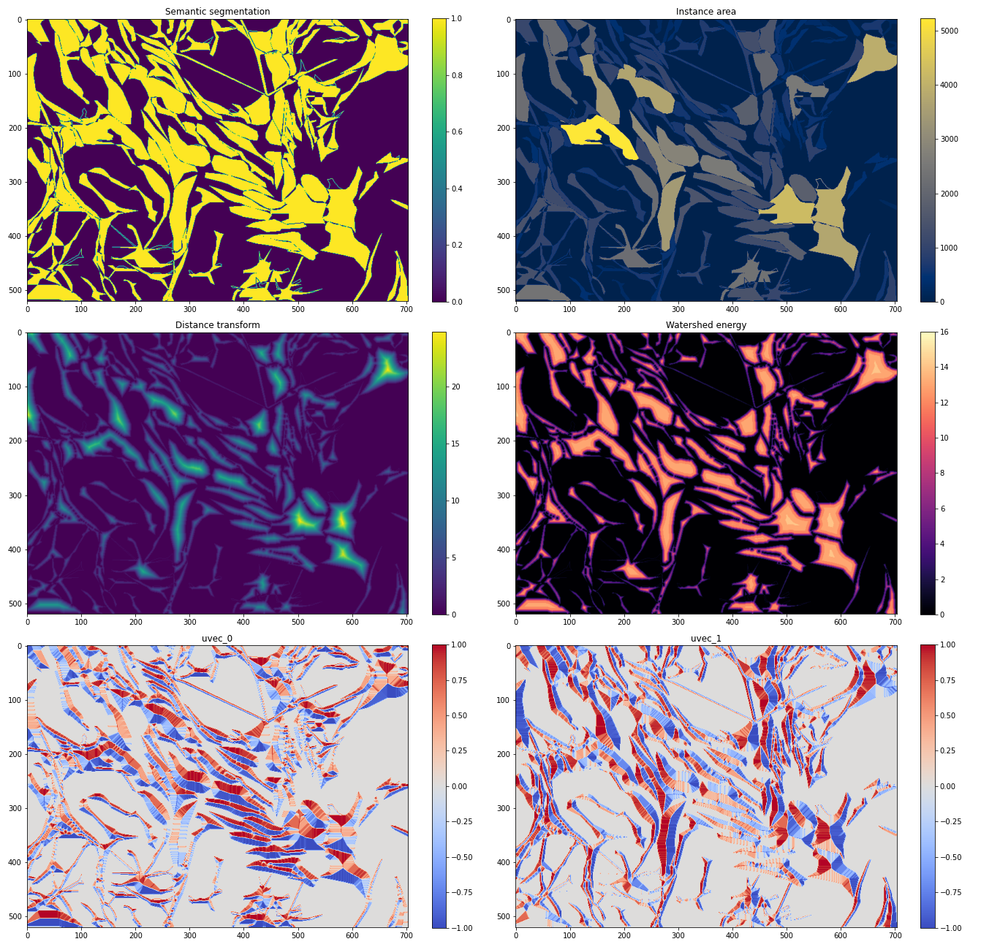

## 2021-11-29

 
The Direction Net appears to be training.  The above plot shows the various 'images' involved in the training of this network.  The network input is the original image that's been gated by the semantic segmentation, so it's an image where the background is removed.  The area of each cell, or instance, is used as weights calculating the loss.  

uvec_0 and uvec_1 are the 0th and 1st components of the noramlised gradient of distance transform.  It can be seen, from how the colour changes from red to blue, that uvec_0 changes along the y-direction, while uvec_1 changes along the x-direction.  It's important to understand that this should always be observed, regardless of the how the image is rotated.  A mistake I have made is to pre-compute these components based on the original image and simply treat them like other masks, like semantic segmentation and instance area.  This is erroneous because whilst the semantic segmentation and instance area of a pixel are invariant under image rotation, the components of the normalised gradient are not.  Therefore, they should be computed from the distance transform *after* any augmentation transforms.  This was confirmed in my experiments, where, when there is no data augmentation, the validation loss decreases even when the gradients are pre-computed, because there is no image rotation.  But when there is image rotation, the validation loss only decrease when the gradients are computed after the image rotation.

About the learning rate.  The authors used 1e-5 for 20 epochs.  I find that works; the validation loss decreases.  However, when I experimented with a one-cycle learning rate scheduler with a maximum learning rate of 1e-2, the validation loss does not really go down.  

cosmic-serenity-5 uses a constant learning rate of 1e-5 for 100 epochs.  

The following experiments include additional heavy data augmentations, and it's clear that the validation loss is lower for these.  rare-meadow-17 uses a maximum one-cycle learning rate of 1e-2, while happy-morning-18 uses 1e-3.  It's interesting that the validation loss decreases but suddenly start to increase, tending towards the same value as rare-meadow-17.  woven-frog-16 uses the same learning rate settings as the paper, a constant value of 1e-5 for 20 epochs.  

It appears that whether data augmentation is used or not, the validation loss tends to the same value.  It's just that in the case where data augmentation is used, it tends towards it from below, while without augmentation, it tends from above.  One apparent exception is woven-frog-16, and it would be interesting to see if it also tends to the same value when trained for more epochs.  

The training loss doesn't appear to decrease with epochs trained.

## 2021-12-01
The distance transform is converted to watershed energy, which is just the distance transform sorted into a relatively small number of bins.  

Here are all the relevant maps that are considered in the overall workflow:

The watershed energy ranges from 0 to 17.  Only larger cells have the highest energy levels.  The watershed energy levels are based on the discrete distance transform values.

## 2021-12-02
The watershed transform network (WTN) is implemented based on the description in the paper, but it's not a exact description, so will likely need to adjust the architecture later.  

The watershed loss has also been implemented based on the equation in the paper.  It's  not clear what the bar over variables $y$ and $t$ means, but given it's something like cross entropy, these are likely just $(1 - y)$ and $1 - t$, respectively.  Because of the pixel weights $w_p$, I first applied `nn.LogSoftmax` to the logits, then multiplied it with $w_p$.  Then, the energy weights $c_k$ are used to define a weighted negative log likelihood loss function with `nn.NLLoss`, which is then applied to the product of $w_p$ and the logits.  

The paper just says that errors in predicting the lower energies should be penalised more, without giving explicit values of $c_k$, so right now, these are just 17, 16, ..., 1. 

## 2021-12-03
Watershed transform network is training via `training/run_experiment.py`.

## 2021-12-04
How to cut the watershed energy to get individual instances is shown here https://github.com/min2209/dwt/blob/master/E2E/post_process.py.  Several functions from `skimage.morphology` are used.  

According to https://github.com/min2209/dwt/blob/master/matlab/generate_GT_cityscapes_unified.m, the authors used Matlab's [`bwdist`](https://www.mathworks.com/help/images/ref/bwdist.html) and [`imgradientxy`](https://www.mathworks.com/help/images/ref/imgradientxy.html) to compute the distance transform and gradient, respectively.  Might want to check if the Python functions I've been using correspond to these.

## 2021-12-05
To load a model from checkpoint and do inference, take the relevant `pl.LightningModule` and use the `load_from_checkpoint` method. Supply the same arguments as for the `__init__` method, plus the argument `checkpoint_path` that points to the checkpoint file produced by pytorch lightning during training, for example, by the `ModelCheckpoint` callback.  

Here's a pair of watershed energy ground truth and prediction by a WTN that's only been trained for 2 epochs:  

